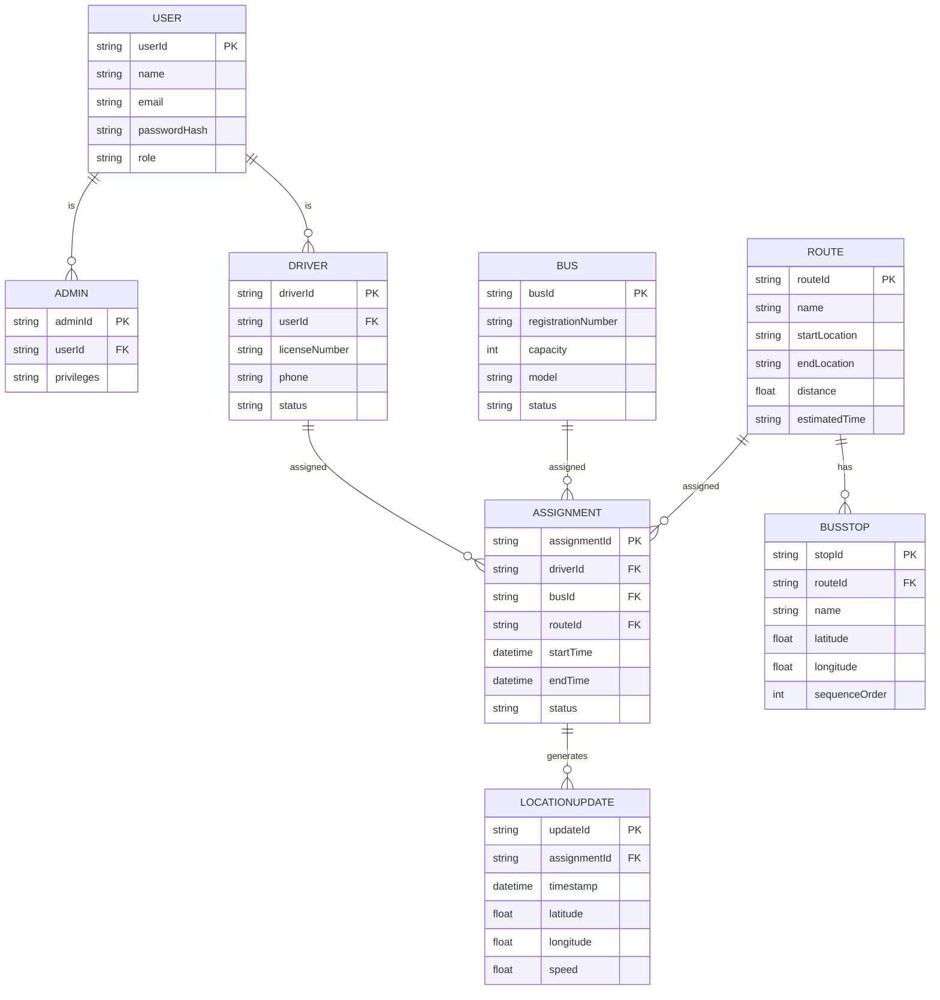
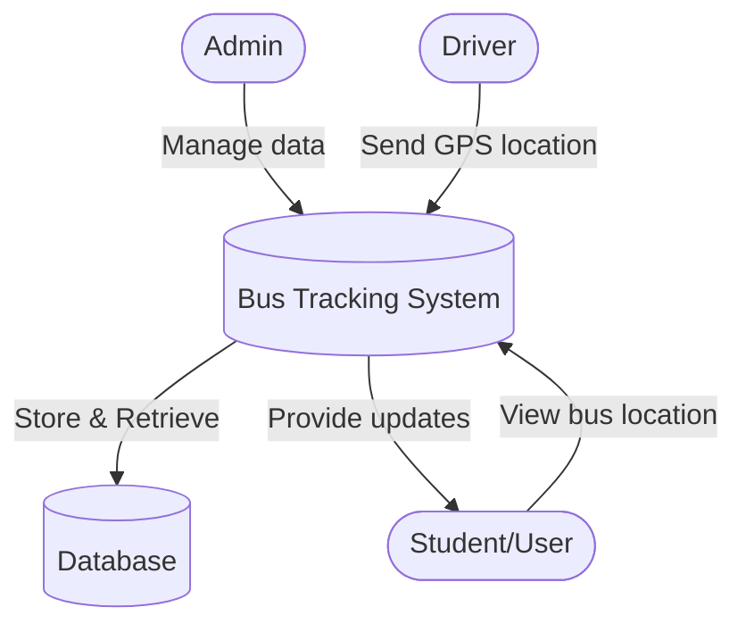
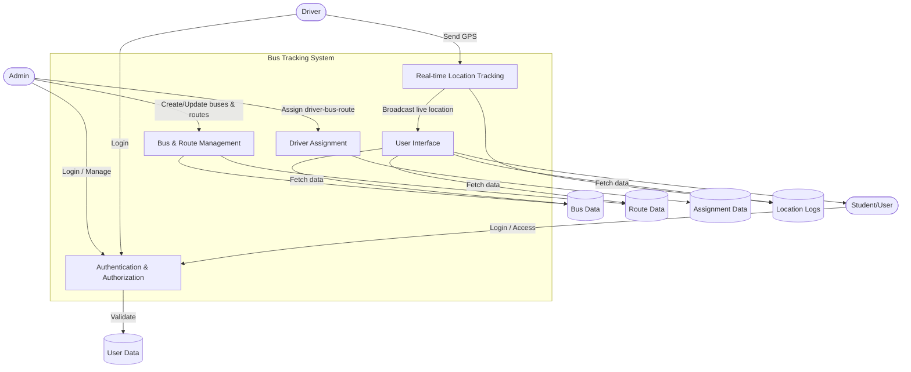

# Where Is My Bus (WIMB)

A real-time bus tracking and management system built with Node.js, Express, MongoDB, and JWT authentication.  

## 🚀 Features
- Driver & Contractor authentication
- Bus & Route management
- Assignments linking driver -> bus -> route
- JWT-secured APIs
- (Incomplete) Real-time GPS tracking with Socket.IO

## 🛠 Tech Stack
- Backend: Node.js, Express
- Database: MongoDB + Mongoose
- Auth: JWT
- Logging: Morgan
- Security: Helmet, CORS
- (Incomplete) Realtime: Socket.IO

## 📦 Installation
1. Clone this repository:
   ```bash
   git clone <repo-url>
   cd WIMB_PROJECT_FP/Backend

2. npm install

3. Create .env from .env.example and configure your values. 

4. Start the server using any of the following command

    npm run dev  
        OR
    npm start 

## 🌐 API Endpoints 
- POST /api/auth/driver/register → Register driver
- POST /api/auth/driver/login → Login driver
- POST /api/buses → Add new bus
- POST /api/routes → Add route
- POST /api/assignments → Assign driver to bus+route
- PATCH /api/assignments/:id/end → End assignment

## 🧪 Testing 
Use the Postman Collection provided in WIMB_PROJECT_FP/Backend/Wimb_Postman_Collection.json

## 🔑 HOw to Use Postman Json 
1. Open Postman -> Import -> select the file provided 
2. Use the requests in order: 
    - Register Driver 
    - Login Driver -> copy  JWT token -> paste into {{token}} varible
    - Create Bus
    - Create Route 
    - Create Assignment
    - End Assignment

## Entity Relationship Diagram 
1. The Entity-Relatioship Diagram for the system --> WIMB_PROJECT_FP/Documentation/Backend-Docs/ER-Diagram_For_WIMB-Backend.png




## Data Flow Diagrams 
1. Level 0 (Simple) - Simple BAckend System DataFlow --> WIMB_PROJECT_FP/Documentation/Backend-Docs/Level-0-DFD-WIMB-Backend.png




   
2. Level 1 (detailed) - Backend System DataFlow in Detail --> WIMB_PROJECT_FP/Documentation/Backend-Docs/Level-1-DFD-Detailed-WIMB-Backend.png



   
