# 🚌 Where Is My Bus (WIMB)

> A real-time bus tracking and management system designed to improve daily commuting by providing transparency, security, and convenience.

Inspired by ride-hailing apps like **Uber**, but built to be **lightweight and affordable**, WIMB bridges the gap between public transportation and smart mobility solutions.

---

## 🚍 Problem Statement
- Students and daily commuters often face uncertainty about bus schedules and delays.  
- Drivers and contractors rely on manual attendance and bus assignment processes, causing inefficiencies.  
- No centralized system exists to **track buses, manage routes, and provide live location updates**.  

---

## 🎯 Objectives
- ✅ Provide **real-time bus tracking** with GPS.  
- ✅ Ensure **secure driver authentication** before trips.  
- ✅ Enable admins to manage **buses, drivers, and routes** seamlessly.  
- ✅ Allow passengers to view **live bus locations & ETA**.  
- ✅ Deliver a **low-cost, efficient alternative** to expensive fleet management tools.  

---

## ✨ Key Features

### 🔐 Authentication
- Secure login for drivers & contractors (via **unique IDs / QR codes**).  
- **JWT-based token system** for secure API access.  

### 🚌 Bus & Route Management
- Register buses with details (**bus number, capacity, etc.**).  
- Define routes (start, end, and intermediate stops).  
- Assign drivers → buses → routes.  

### 📡 Real-Time Tracking
- GPS-enabled driver app shares location.  
- Backend broadcasts location via **Socket.IO**.  
- Passengers see **live updates + historical route data** (optional).  

### 📱 User Experience
- **Mobile App (Android)**  
  - Driver: GPS location sharing  
  - Passenger: Bus tracking  
- **Web App**  
  - Admins & Students monitor buses in real time.  
- **Modern UI/UX** using React & React Native/Flutter.  

### 🧩 Extra Features (Future Scope)
- QR code scanning for easy driver assignment.  
- Push notifications (bus departure, arrival alerts).  
- Attendance tracking for students.  
- Data analytics: punctuality & bus usage reports.  

---

## 🛠 Tech Stack

| Component        | Technology                       |
|------------------|---------------------------------|
| **Frontend (Web)**   | React.js, Tailwind CSS / Material UI |
| **Mobile App**       | React Native / Flutter         |
| **Backend**          | Node.js, Express.js            |
| **Database**         | MongoDB (Mongoose ODM)         |
| **Authentication**   | JWT (JSON Web Tokens)          |
| **Real-time**        | Socket.IO (GPS live updates)   |
| **Other Tools**      | Postman, Git/GitHub            |

---

## 📐 System Workflow

1. Driver logs in → authenticates (ID/QR).  
2. Driver assigned to bus & route.  
3. Driver app starts GPS sharing → Backend receives continuous location.  
4. Backend broadcasts updates via **Socket.IO**.  
5. Passengers open app → view bus position + ETA.  
6. Admins/Contractors → manage assignments, monitor buses, generate reports.  

  

## System Flow 

```mermaid
flowchart TD
    A[Driver Login] --> B[Auth via ID/QR]
    B --> C[Assign Driver → Bus → Route]
    C --> D[Driver App GPS Sharing]
    D --> E[Backend Receives Location]
    E --> F[Broadcast via Socket.IO]
    F --> G[Passengers View on App]
    E --> H[Admins Monitor & Manage]
```

 

## DFD of the System 

